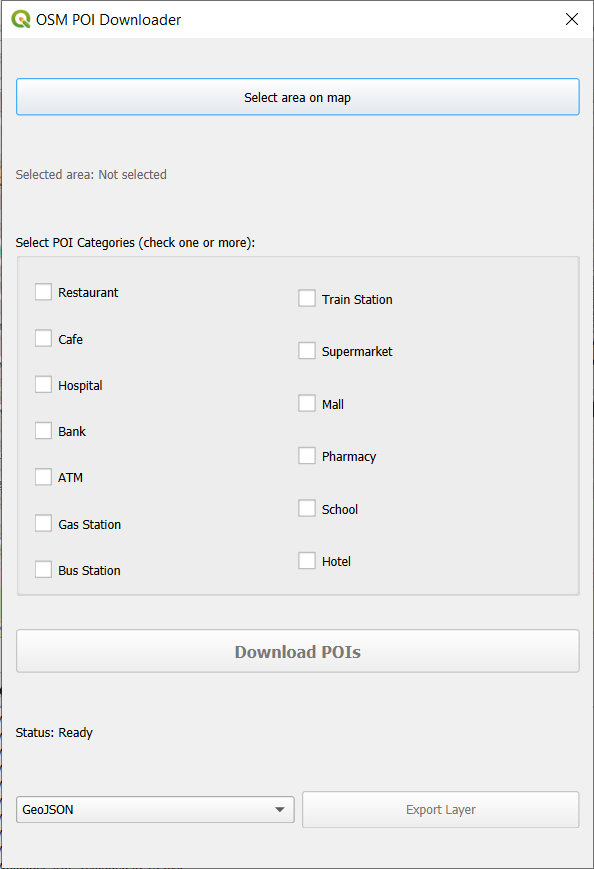
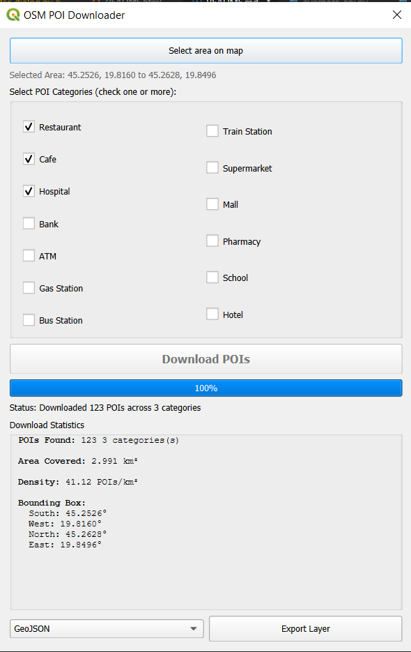
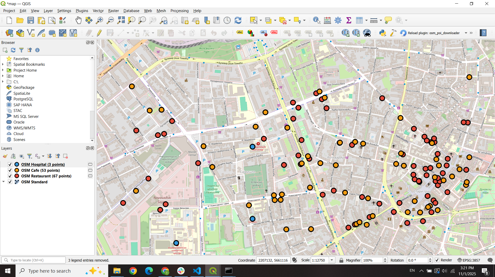
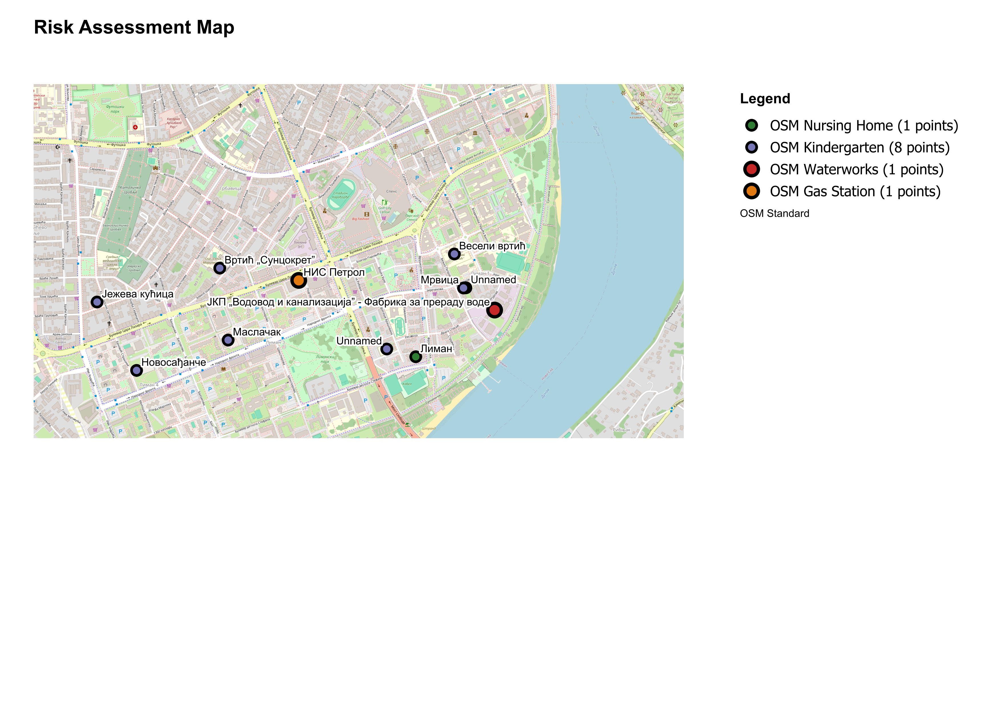

# OSM POI Downloader - QGIS Plugin

A QGIS plugin for risk assessment mapping by downloading and visualizing Points of Interest (POI) data from OpenStreetMap using the Overpass API. Designed for identifying potential hazards (Risk Zones) and sensitive locations (Vulnerable Populations).

## Overview

This plugin enables rapid risk assessment by downloading and mapping two critical categories of locations from OpenStreetMap:
- **Risk Zones**: Industrial facilities and infrastructure that may pose hazards
- **Vulnerable Populations**: Facilities serving sensitive groups requiring special consideration

Users can draw a bounding box on the map, select categories, and automatically visualize the data with intelligent color-coding and density-based labeling.

## Features

### Core Functionality
- **Interactive Area Selection**: Draw a rectangle directly on the QGIS map canvas to define your search area
- **Risk Assessment Categories**: Two main category groups with 17 total POI types:

#### Risk Zones (Industrial & Infrastructure Hazards)
  - Factory
  - Gas Station
  - Power Plant
  - Power Substation
  - Railway Station
  - Railway Halt
  - Waterworks
  - Wastewater Plant
  - Industrial Zone

#### Vulnerable Populations (Sensitive Facilities)
  - School
  - Kindergarten
  - Hospital
  - Clinic
  - Nursing Home
  - Social Facility
  - Childcare
  - Community Centre

### Advanced Features
- **Color-Coded Visualization**: 
  - Risk Zones displayed in red/orange palette for immediate hazard identification
  - Vulnerable Populations shown in blue/green palette for clarity
  - Different marker sizes for visual distinction
- **Smart Density-Based Labeling**: 
  - Automatic label display in low-density areas (< 10 POIs/km²)
  - Labels hidden in high-density urban areas to prevent clutter
  - Intelligent edge-case handling for very small areas
- **Batch Query Optimization**:
  - Batch mode for 3+ categories (single API call for efficiency)
  - Individual mode with rate-limiting delays for 1-2 categories
  - Automatic retry logic with exponential backoff for reliability
- **Statistical Analysis**: Automatic calculation of:
  - Number of POIs found per category
  - Area covered (km²)
  - POI density (POIs per km²)
  - Geographic bounds
- **Map Export with Automatic Legend**:
  - Export complete map canvas to PNG, JPEG, or PDF
  - Automatically generated legend showing all visible layers
  - Custom title input
  - Professional layout with scale bar
- **Data Export**: Export downloaded POI data to:
  - GeoJSON format (for use in web maps and other GIS software)
  - CSV format (for use in spreadsheets and databases)
- **Batch Export**: Export all downloaded layers at once or select specific layers to export

## Installation

### Requirements
- QGIS 3.0 or higher (tested on QGIS 3.40)
- Internet connection (for accessing OpenStreetMap Overpass API)
- Python 3.9 or higher

### Installing the Plugin

#### Method 1: From Source (for development/testing)

1. Clone or download this repository
2. Copy the `osm_poi_downloader` folder to your QGIS plugins directory:
   - **Windows**: `C:\Users\<YourName>\AppData\Roaming\QGIS\QGIS3\profiles\default\python\plugins\`
   - **Linux**: `~/.local/share/QGIS/QGIS3/profiles/default/python/plugins/`
   - **Mac**: `~/Library/Application Support/QGIS/QGIS3/profiles/default/python/plugins/`
3. Restart QGIS
4. Enable the plugin:
   - Go to `Plugins` → `Manage and Install Plugins`
   - Find "OSM POI Downloader" in the Installed tab
   - Check the box to activate it

#### Method 2: Via Plugin Repository (when published)
1. In QGIS, go to `Plugins` → `Manage and Install Plugins`
2. Search for "OSM POI Downloader"
3. Click `Install Plugin`

## Usage

### Basic Workflow

1. **Open the Plugin**
   - Click the plugin icon in the toolbar, or
   - Go to `Plugins` → `OSM POI Downloader` → `Download OSM POIs`

2. **Select POI Categories**
   - Check one or more POI categories you want to download
   - You can select multiple categories to download them all at once

3. **Define Search Area**
   - Click `Select area on map`
   - The dialog will hide and your cursor will become a crosshair
   - Click and drag on the map to draw a rectangle
   - Release the mouse to confirm the selection
   - The dialog will reappear with the selected coordinates

4. **Download POIs**
   - Click `Download POIs`
   - Progress bar shows download status
   - For 3+ categories: single batch request (faster)
   - For 1-2 categories: individual requests with delays (more reliable)
   - Upon completion, new layers appear in the Layers panel with appropriate colors
   - Statistics panel shows analysis of the downloaded data

5. **Export Data (Optional)**
   - Select export format (GeoJSON or CSV) from the dropdown
   - Click `Export Layer`
   - Choose to export all layers or select specific ones
   - Select save location

6. **Export Map (Optional)**
   - Click `Export Map with Legend`
   - Choose format (PNG, JPEG, or PDF)
   - Enter custom map title
   - Select save location
   - Map is exported with automatic legend

### Tips for Best Results

- **Area Size**: For best performance, keep your search area under 25 km²
- **Dense Areas**: In city centers, smaller areas work better
- **Category Selection**: 
  - Select 3+ categories for faster batch download
  - Mix Risk Zones and Vulnerable Populations for comprehensive assessment
- **No Results**: If no POIs are found, try:
  - A larger area
  - Different categories (some POI types may not be well-mapped in all regions)
  - A different location
- **Labeling**: Labels automatically adjust based on density - sparse areas show labels, dense areas don't

## Screenshots

### Main Interface


### Results with Statistics


### Multiple Layers


### Exported Map with Legend


## Technical Details

### Architecture

The plugin consists of several modular components:

- **`osm_poi_downloader.py`**: Main plugin class and QGIS integration
- **`osm_poi_downloader_dialog.py`**: User interface logic and workflow coordination
- **`map_tool_select_area.py`**: Custom map tool for interactive rectangle selection
- **`overpass_api.py`**: Overpass API client with query builder, batch processing, retry logic, and response parser
- **`poi_layer_creator.py`**: QGIS layer creation, color-coded styling, and density-based labeling
- **`exporter.py`**: Data export functionality (GeoJSON, CSV)
- **`map_exporter.py`**: Map canvas export with automatic legend generation
- **`statistics_calculator.py`**: Geographic calculations and statistics

### Data Source

All POI data comes from **OpenStreetMap** via the **Overpass API**:
- Data is licensed under the [Open Database License (ODbL)](https://opendatacommons.org/licenses/odbl/)
- Contributors: OpenStreetMap community
- Data quality varies by region based on mapping activity

### API Usage

This plugin uses the public Overpass API endpoint (`https://overpass-api.de/api/interpreter`):
- Batch queries for 3+ categories (single API call)
- Individual queries with 2-second delays for 1-2 categories
- Automatic retry logic with exponential backoff (3 attempts)
- Queries timeout after 25 seconds (individual) or 60 seconds (batch)
- Fair use policy applies
- For heavy usage, consider running your own Overpass instance

### Query Optimization

The plugin intelligently chooses between two query modes:
- **Batch Mode (3+ categories)**: Single Overpass query for all categories, faster and more efficient
- **Individual Mode (1-2 categories)**: Separate queries with delays, more reliable for small requests
- **Retry Logic**: Automatically retries failed requests up to 3 times with exponential backoff

### Visualization Features

- **Color Coding**:
  - Risk Zones: Red to orange gradient
  - Vulnerable Populations: Blue to green gradient
- **Marker Sizing**:
  - Risk Zones: 4mm diameter with 1.0mm outline
  - Vulnerable Populations: 3mm diameter with 0.8mm outline
- **Smart Labeling**:
  - Density threshold: 10 POIs/km²
  - Areas below threshold: labels enabled
  - Areas above threshold: labels disabled
  - Minimum area threshold: 0.01 km² (labels always shown for smaller areas)

## Limitations

- **Area Size**: Very large areas (>50 km²) may timeout or return incomplete results
- **Rate Limits**: Excessive queries may be temporarily throttled by the Overpass API
- **Data Coverage**: POI availability depends on OpenStreetMap mapping completeness in the region
- **Coordinate System**: Works in any CRS but converts to WGS84 (EPSG:4326) for API queries
- **Network Dependency**: Requires active internet connection

## Troubleshooting

### Common Issues

**Problem**: Plugin doesn't appear in the Plugins menu
- **Solution**: Make sure the plugin folder is in the correct location and QGIS was restarted

**Problem**: "Request timed out" error
- **Solution**: The area may be too large or the API is busy. Try a smaller area or select fewer categories

**Problem**: "504 Gateway Timeout" error
- **Solution**: The Overpass API is overloaded. Wait a minute and try again with a smaller area

**Problem**: No POIs found in an urban area
- **Solution**: The selected category may not be well-mapped in that region. Try different categories or check OpenStreetMap coverage

**Problem**: Export button is disabled
- **Solution**: Download POIs first before attempting to export

**Problem**: Labels are missing or too crowded
- **Solution**: This is automatic based on density. High-density areas don't show labels to prevent clutter

**Problem**: Batch download fails
- **Solution**: Try downloading categories individually (1-2 at a time) or reduce the area size

## Development

### Project Structure
```
osm_poi_downloader/
├── __init__.py                          # Plugin entry point
├── metadata.txt                         # Plugin metadata
├── osm_poi_downloader.py               # Main plugin class
├── osm_poi_downloader_dialog.py        # Dialog logic
├── osm_poi_downloader_dialog_base.ui   # UI layout (Qt Designer)
├── osm_poi_downloader_dialog_base.py   # Generated from .ui file
├── map_tool_select_area.py             # Map selection tool
├── overpass_api.py                     # API client with batch & retry logic
├── poi_layer_creator.py                # Layer creation, styling, labeling
├── exporter.py                         # Export functionality
├── map_exporter.py                     # Map canvas export with legend
├── statistics_calculator.py            # Statistics calculations
├── resources.py                        # Qt resources (icons)
└── icon.png                            # Plugin icon
```

### Building from Source

1. Clone the repository
2. Make modifications to the code
3. If UI changes are made:
   ```bash
   pyuic5 -o osm_poi_downloader_dialog_base.py osm_poi_downloader_dialog_base.ui
   ```
4. If resources change:
   ```bash
   pyrcc5 -o resources.py resources.qrc
   ```

## Use Cases

### Risk Assessment Planning
- Identify industrial hazards near sensitive populations
- Assess vulnerability of schools and hospitals to nearby hazards
- Plan emergency response routes and evacuation zones

### Urban Planning
- Analyze distribution of vulnerable population facilities
- Evaluate industrial zone placement relative to residential areas
- Support zoning decisions with spatial analysis

### Research & Analysis
- Study spatial relationships between hazards and vulnerable groups
- Generate maps for reports and presentations
- Export data for further GIS or statistical analysis

## Author

**Isidora Pavlović**
- Email: isidorapavlovic0@gmail.com
- GitHub: [pavlovicisidora](https://github.com/pavlovicisidora/qgis-thesis)
